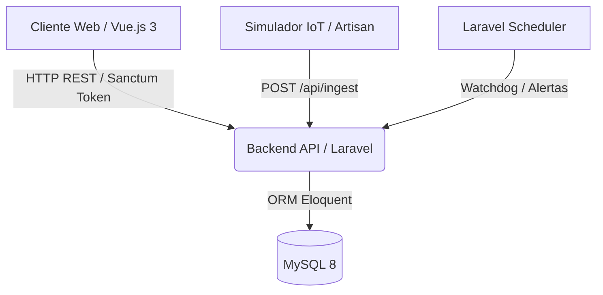
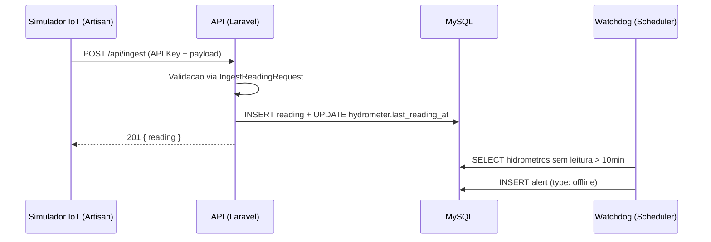

# HydroTrack

      


## Visao geral

O HydroTrack e uma plataforma de monitoramento de telemetria hidrica IoT que simula a recepcao, processamento e visualizacao em tempo real de dados de consumo provenientes de sensores (hidrometros) instalados em campo.

1. **Stack principal:** PHP, Laravel, Eloquent, MySQL, Sanctum, Vue.js 3, Pinia, Tailwind CSS e Leaflet.js.
2. **Diferenciais:** Simulacao realista de sensores IoT via comandos Artisan, mapa interativo com geolocalizacao dos hidrometros, sistema de alertas automaticos para consumo anormal e dispositivos offline, e dashboard analitico com graficos de consumo temporal.
3. **Repositorio oficial:** [github.com/gabriellqv/hydrotrack](https://github.com/gabriellqv/hydrotrack)

## Preview

<div align="center">
  <i>Screenshots serao adicionados conforme o desenvolvimento das telas.</i>
</div>

## Resultados e impacto

1. **Telemetria em tempo real:** O simulador IoT gera leituras com variacao realista de consumo e as injeta na API, reproduzindo o comportamento de sensores fisicos em campo.
2. **Visibilidade geoespacial:** O mapa interativo com Leaflet posiciona cada hidrometro por coordenadas GPS, permitindo identificacao visual imediata de regioes com anomalias.
3. **Deteccao proativa de falhas:** O sistema de alertas automaticos identifica consumo excessivo, leituras zeradas e dispositivos offline, notificando o operador antes que o problema escale.
4. **Seguranca por camadas:** A autenticacao via Sanctum combinada com middleware de RBAC garante que apenas administradores executem operacoes criticas como cadastro e exclusao de hidrometros.

## Arquitetura do sistema



### Fluxo de ingestao de leituras IoT



## Tecnologias

| Camada | Tecnologia |
|---|---|
| **Frontend** | Vue.js 3, TypeScript, Composition API, Tailwind CSS 4, Pinia, Vue Router |
| **Mapas** | Leaflet.js (vue-leaflet) |
| **Graficos** | Chart.js (vue-chartjs) |
| **Backend** | Laravel 13, PHP 8.5, Eloquent ORM, Scribe |
| **Banco** | MySQL 8 |
| **Autenticacao** | Laravel Sanctum (Token SPA) |
| **Testes Backend** | Pest PHP |
| **Testes Frontend** | Vitest, Vue Test Utils |
| **Linting Backend** | Laravel Pint |
| **Linting Frontend** | ESLint (Flat Config), Oxlint, Prettier |
| **DevOps** | Docker Compose, GitHub Actions |
| **Qualidade** | Husky, lint-staged, Commitlint (Conventional Commits) |

## Funcionalidades

1. Autenticacao via tokens Sanctum com restricao de rotas por perfis de acesso (admin e operador).
2. Cadastro de hidrometros com coordenadas GPS, bairro, tipo de imovel e status operacional.
3. Ingestao de leituras de consumo hidrico via endpoint M2M protegido por API Key.
4. Simulador IoT via comando Artisan que gera leituras realistas para todos os hidrometros cadastrados.
5. Dashboard analitico com metricas de consumo total, media por bairro e hidrometros em alerta.
6. Mapa interativo exibindo a posicao geografica de cada hidrometro com indicador visual de status.
7. Sistema de alertas automaticos para consumo excessivo, leituras zeradas e dispositivos offline.
8. Resolucao manual de alertas por operadores com registro de data e hora da acao.
9. Documentacao da API gerada automaticamente via Scribe no padrao OpenAPI.

## Decisoes tecnicas

1. **Controllers magros:** Toda logica de negocio reside nos Services. Os Controllers apenas recebem a request validada, delegam ao Service e retornam a response formatada via API Resources.
2. **Form Requests dedicados:** A validacao de entrada e isolada em classes FormRequest, garantindo que nenhum dado invalido chegue a camada de negocio.
3. **Simulacao IoT realista:** O comando Artisan gera leituras com variacao gaussiana de consumo, simulando comportamento real de sensores para popular o banco com dados verossimeis.
4. **Estado reativo tipado:** O estado da aplicacao no frontend e mantido via Pinia em stores isoladas com tipagem TypeScript completa, eliminando erros silenciosos em tempo de desenvolvimento.
5. **RBAC via Middleware:** O controle de acesso por perfil e resolvido na camada de middleware do Laravel, antes mesmo de chegar ao Controller, centralizando a logica de autorizacao.

## Estrutura do projeto

```
hydrotrack/
  backend/
    app/
      Console/Commands/     # Simulador IoT (SimulateIotCommand)
      Http/
        Controllers/        # Controllers magros (Auth, Hydrometer, Reading, Dashboard, Alert)
        Middleware/          # RBAC (EnsureIsAdmin)
        Requests/           # Form Requests (validacao de entrada)
        Resources/          # API Resources (formatacao JSON de saida)
      Models/               # Eloquent Models (User, Hydrometer, Reading, Alert)
      Services/             # Logica de negocio isolada
    database/
      factories/            # Factories para testes (Pest)
      migrations/           # Schema do banco (users, hydrometers, readings, alerts)
      seeders/              # Seed com 200+ hidrometros geolocalizados
    routes/
      api.php               # Rotas REST da API
    tests/
      Feature/              # Testes de integracao
      Unit/                 # Testes unitarios
  frontend/
    src/
      components/           # Componentes reutilizaveis (ui/, MapView, Charts, AlertBadge)
      views/                # Paginas (Login, Dashboard, Hydrometers, Alerts, Map)
      stores/               # Pinia stores (auth, hydrometer, dashboard, alert)
      services/             # Cliente HTTP centralizado (Axios)
      router/               # Vue Router com guards de autenticacao
      types/                # Interfaces TypeScript compartilhadas
  docker-compose.yml        # Orquestracao de containers
  .github/workflows/        # Pipeline CI/CD
```

## Como executar

### Pre-requisitos

1. PHP 8.5 ou versao superior (com extensoes: pdo_mysql, mbstring, curl, zip).
2. Composer 2.2 ou versao superior.
3. Node.js 20 ou versao superior.
4. Docker e utilitario Docker Compose (opcional).

### Configuracao do ambiente

Copie os arquivos de exemplo e preencha as variaveis:

```bash
cp backend/.env.example backend/.env
cp frontend/.env.example frontend/.env.local
```

Variaveis do backend:

| Variavel | Descricao | Exemplo |
|---|---|---|
| `DB_CONNECTION` | Driver do banco de dados | `mysql` |
| `DB_HOST` | Endereco do servidor MySQL | `127.0.0.1` |
| `DB_PORT` | Porta do MySQL | `3306` |
| `DB_DATABASE` | Nome do banco | `hydrotrack` |
| `DB_USERNAME` | Usuario do banco | `root` |
| `DB_PASSWORD` | Senha do banco | `secret` |
| `APP_URL` | URL base da API | `http://localhost:8000` |
| `FRONTEND_URL` | Origem autorizada para CORS | `http://localhost:5173` |

### Inicializacao via Docker

```bash
docker-compose up --build -d
```

1. API Backend: `http://localhost:8000`
2. Frontend Vue: `http://localhost:5173`
3. Documentacao da API: `http://localhost:8000/docs`

### Desenvolvimento local (sem Docker)

```bash
# Backend
cd backend
composer install
cp .env.example .env
php artisan key:generate
php artisan migrate --seed
php artisan serve

# Frontend (em outro terminal)
cd frontend
npm install
cp .env.example .env.local
npm run dev
```

### Credenciais de teste

| Campo | Valor |
|---|---|
| Email | `admin@hydrotrack.com` |
| Senha | `admin123` |

### Simulador IoT

Para popular o banco com leituras realistas:

```bash
cd backend
php artisan iot:simulate --count=50
```

## Testes

A suite de testes cobre as camadas criticas do sistema com execucao automatica pelo GitHub Actions.

```bash
# Backend (Pest PHP)
cd backend && php artisan test

# Frontend (Vitest)
cd frontend && npm run test:unit
```

| Camada | Framework | Escopo |
|---|---|---|
| Backend | Pest PHP | Testes unitarios e de integracao (Services, Controllers, Auth) |
| Frontend | Vitest + Vue Test Utils | Testes de componentes e stores |

## Status do projeto

1. Estrutura do monorepo configurada com ferramentas de qualidade profissional.
2. Pipeline de linting automatico via pre-commit hooks (Husky + lint-staged).
3. Padronizacao de commits ativa via Commitlint (Conventional Commits).
4. Backend e frontend scaffoldados e prontos para desenvolvimento das features.
